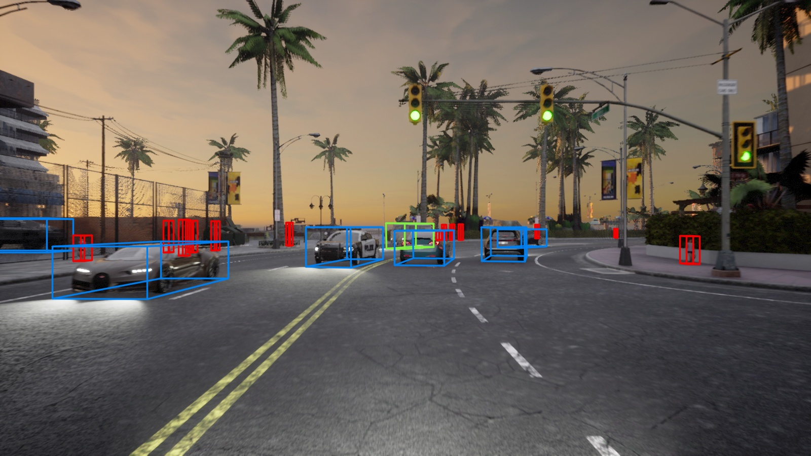
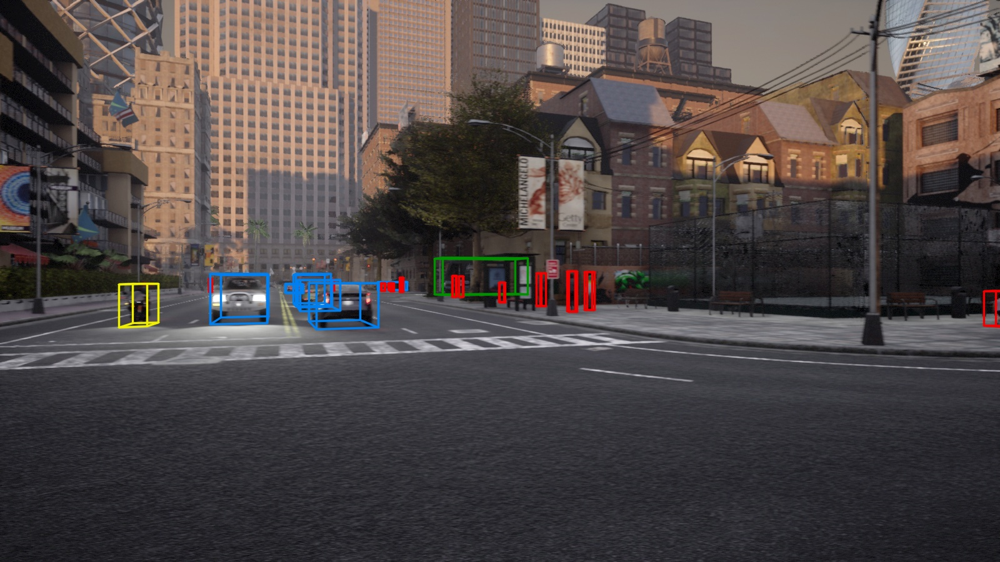
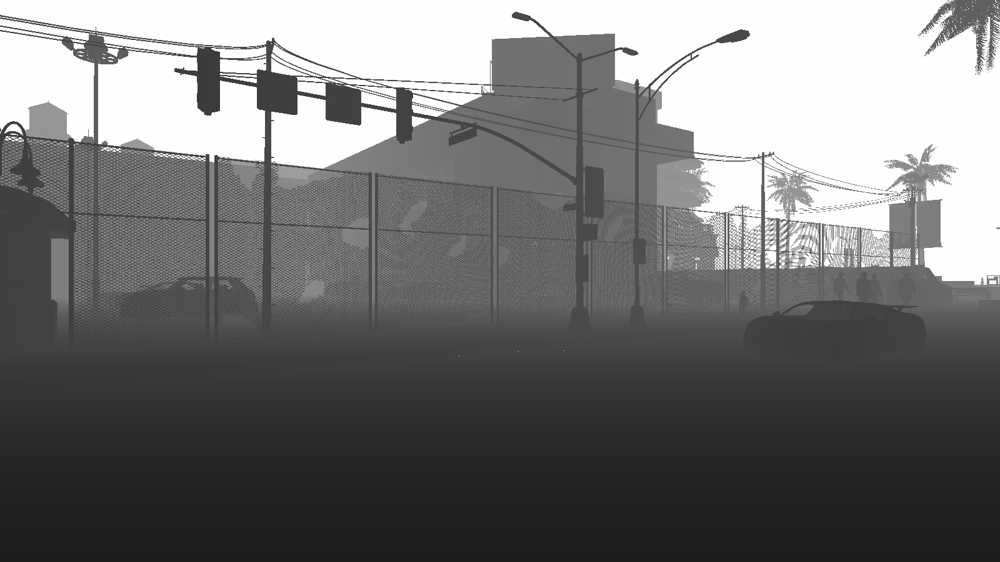
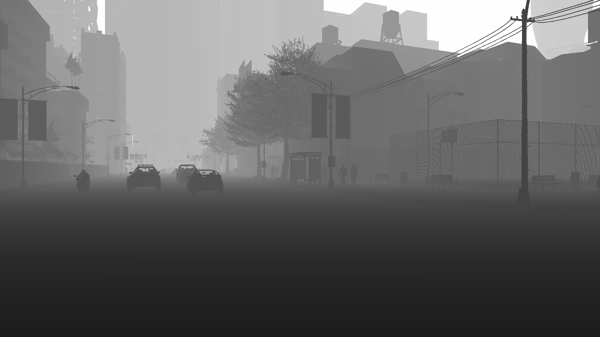
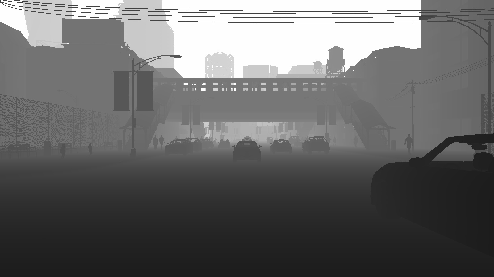
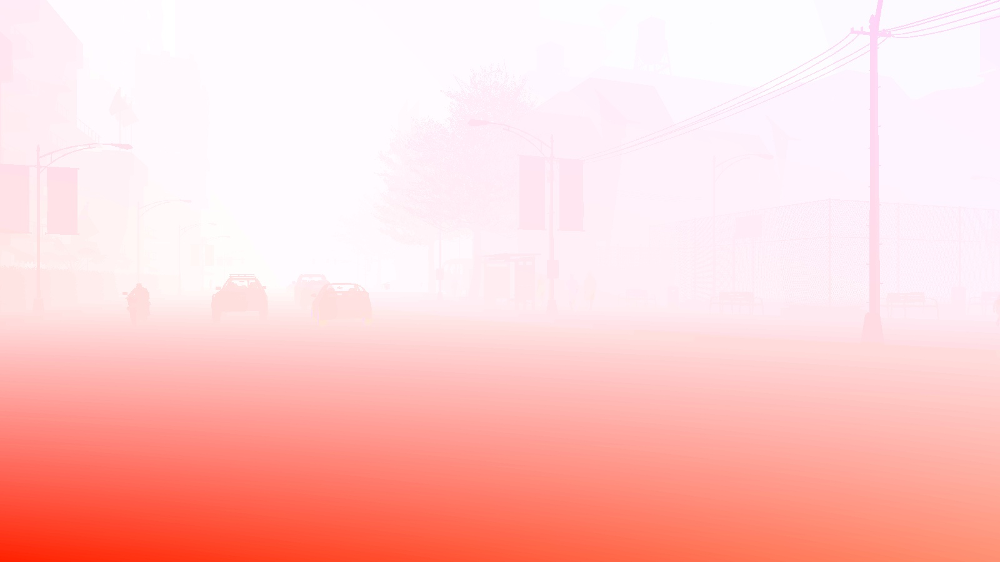
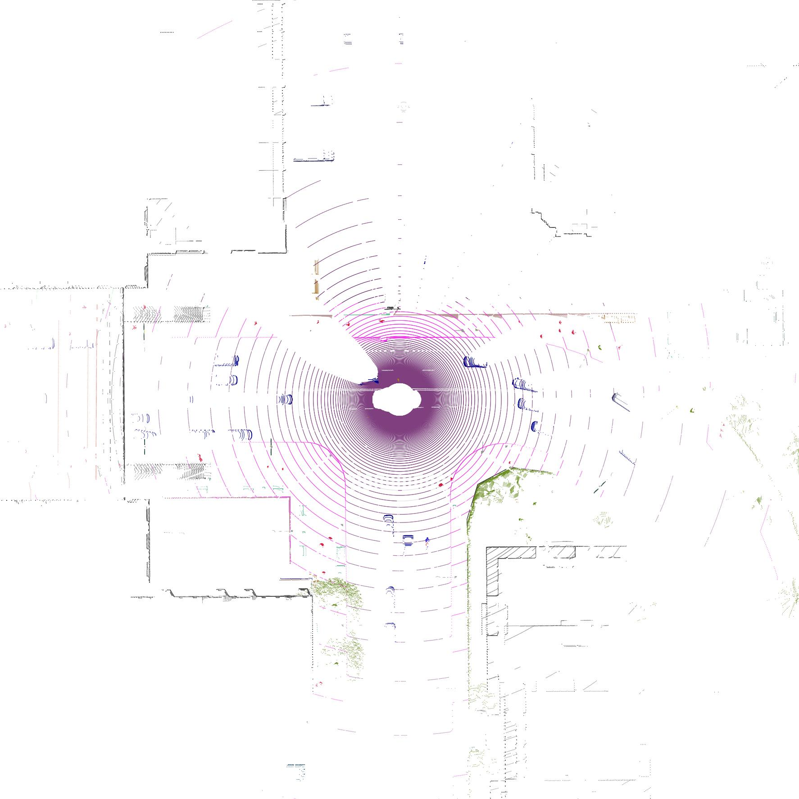
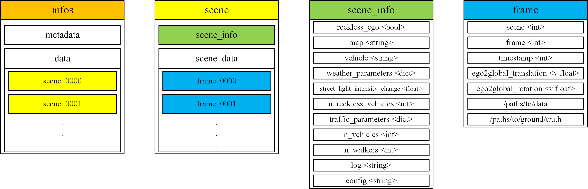

# <p align="center"> SimBEV: A Synthetic Multi-Task Multi-Sensor Driving Data Generation Tool and Dataset </p>

<p align="center">
  <a href="https://arxiv.org/abs/2502.01894" alt="SimBEV Paper">
      </a>
  <a href="https://drive.google.com/drive/folders/14MytQeGmW80Btg_AGPNrE18ZLdLzyGx5" alt="SimBEV Dataset">
      </a>
  <a href="https://simbev.org" alt="SimBEV Project Page">
      </a>
  <a href="https://youtu.be/5hDH31RDk8c" alt="SimBEV Video">
      </a>
</p>
<p align="center">
  <a href="https://scholar.google.com/citations?hl=en&user=zXkVUDgAAAAJ">Goodarz Mehr</a>, <a href="https://scholar.google.com/citations?user=mLc5_pcAAAAJ">Azim Eskandarian</a>
<br>
Virginia Commonwealth University
</p>

https://github.com/user-attachments/assets/af074eff-b30c-43e0-b544-1b38b77d3345

## Table of Contents

- [News](#news)
- [About](#about)
- [Installation](#installation)
  - [Hardware Requirements](#hardware-requirements)
  - [CARLA](#carla)
  - [SimBEV](#simbev)
- [Usage](#usage)
  - [Creating/Expanding/Replacing a SimBEV Dataset](#creatingexpandingreplacing-a-simbev-dataset)
  - [Post-processing](#post-processing)
  - [Data Visualization](#data-visualization)
  - [Using the SimBEV Dataset](#using-the-simbev-dataset)
- [Data Format](#data-format)
  - [Sensor Setup](#sensor-setup)
  - [Folder Structure](#folder-structure)
    - [configs](#configs)
    - [ground-truth](#ground-truth)
    - [infos](#infos)
    - [logs](#logs)
    - [sweeps](#sweeps)
- [SimBEV Dataset Benchmarks](#simbev-dataset-benchmarks)
  - [3D Object Detection](#3d-object-detection)
  - [BEV Segmentation](#bev-segmentation)
- [Acknowledgement](#acknowledgement)
- [Citation](#citation)

## News
**[2025/8/15]** SimBEV 2.0 is released, with support for new 3D and BEV classes, continuous weather shifts, and more.

<p align="middle">
  
  
</p> 
<p align="middle">
  
 
 
</p> 

**[2025/4/15]** [Our implementation](https://github.com/GoodarzMehr/UniTR) of [UniTR](https://github.com/Haiyang-W/UniTR) trained on the SimBEV dataset is released.

**[2025/2/9]** [Our implementation](https://github.com/GoodarzMehr/bevfusion) of [BEVFusion](https://github.com/mit-han-lab/bevfusion) trained on the SimBEV dataset is released.

**[2025/2/6]** Initial release of dataset, code, and paper.

## About

SimBEV is a configurable and scalable synthetic driving data generation tool based on the CARLA Simulator. It supports a comprehensive array of sensors and incorporates information from various sources to capture accurate bird's-eye view (BEV) ground truth alongside 3D object bounding boxes to enable a variety of perception tasks, including BEV segmentation and 3D object detection. SimBEV is used to create the SimBEV dataset, a large collection of annotated perception data from diverse driving scenarios.


###### <p align="center"> A data sample generated by SimBEV. The left half depicts a 360-degree view of the ego (data collection) vehicle's surroundings produced by different camera types (from top to bottom RGB, semantic segmentation, instance segmentation, depth, and optical flow cameras, respectively). On the right half, views of lidar, semantic lidar, radar, and BEV ground truth data are shown from top to bottom, respectively. Some images also contain 3D object bounding boxes. </p>

SimBEV randomizes a variety of simulation parameters to create a diverse set of scenarios. To create a new dataset, SimBEV generates and collects data from consecutive episodes, or scenes. The user configures the desired number of scenes for each map (can be an existing CARLA map or a custom one) for the training, validation, and test sets, a variety of simulation parameters, and the sensors that should be used. The user can add more scenes to an existing SimBEV dataset, replace individual scenes, or replay individual scenes to collect additional data. SimBEV works with any CARLA map, even custom maps created by the user.

SimBEV currently supports five camera types (RGB, semantic segmentation, instance segmentation, depth, and optical flow), lidar, semantic lidar, radar, GNSS, and IMU. The user has full control over each sensor's characteristics (e.g. camera resolution or number of lidar channels), but the placement of the sensors is fixed for now. In addition to sensor data that can be used as ground truth (e.g. semantic segmentation and depth images, semantic lidar point cloud, etc.), SimBEV currently offers three annotation types: 3D object bounding boxes, BEV ground truth, and HD map information.

SimBEV currently produces 3D object bounding boxes for the following 10 classes: _car_, _truck_, _bus_, _motorcycle_, _bicycle_, _pedestrian_, _traffic light_, _traffic sign_, _traffic cone_, and _barrier_. For each class, the bounding boxes are categorized as _easy_, _medium_, or _hard_ based on detection difficulty. Moreover, SimBEV currently supports the following 14 BEV ground truth classes: _road_, _hazard area_, _road line_, _sidewalk_, _crosswalk_, _traffic cone_, _barrier_, _car_, _truck_, _bus_, _motorcycle_, _bicycle_, _rider_, _pedestrian_.

The SimBEV dataset (collected using SimBEV 1.0) is a collection of 320 scenes spread across 11 CARLA maps and contains data from all supported sensors. With each scene lasting 16 seconds at a frame rate of 20 Hz, the SimBEV dataset contains 102,400 annotated frames, 8,315,935 3D object bounding boxes (3,792,499 of which are _valid_, i.e., not fully occluded and visible to the sensors), and 2,793,491,357 BEV ground truth labels.

## Installation

### Hardware Requirements

We developed and tested SimBEV on a system with the following specifications:
* AMD Ryzen 9 9950X (Any Intel 9th Gen or newer or Ryzen 7/9 3rd Gen or newer will probably work)
* 96 GB RAM (32 GB is probably enough)
* Nvidia GeForce RTX 4090
* Ubuntu 22.04

To run SimBEV, your system must satisfy CARLA 0.9.16's [minimum system requirements](https://github.com/carla-simulator/carla/tree/ue4-dev?tab=readme-ov-file#recommended-system).

### CARLA

To run SimBEV, you must use our custom version of CARLA (built from source from [this fork](https://github.com/GoodarzMehr/carla/tree/ue4-dev-local) of the `ue4-dev` branch). Some of the enhancements in our version are:

* Addition of three new sports cars to CARLA's vehicle library using existing 3D models: sixth generation Ford Mustang, Toyota GR Supra, and Bugatti Chiron. The Ford Mustang is SimBEV's default data collection vehicle.

https://github.com/user-attachments/assets/71fa7403-7e5f-4365-b385-5f5fd3801049

* Addition of lights (headlights, taillights, blinkers, etc.) to those older vehicle models in CARLA's library that lacked them, and redesigning of existing vehicle lights in Blender using a new multi-layer approach that better visualizes modern multi-purpose lights.

<p align="middle">
  
</p>

* Addition of a set of 160 standard paint colors for most vehicle models (apart from a few like the firetruck) to choose from, and fixing paint color randomization issues for a few vehicles (e.g. the bus).
* Update to the vehicle dynamics parameters of vehicle models to better match their vehicle's behavior and performance in the real world.
* Addition of or updating pedestrian navigation information for CARLA's Town12, Town13, and Town15 maps.
* Update to motorcycle and bicycle models to select their driver model randomly, instead of always using the same model.
* Addition of lights to buildings in Town12 and fixing issues that prevented full control over building/street lights in Town12 and Town15.
* Update to the crosswalk information in the OpenDRIVE map files of Town12, Town13, and Town15.
* Improvements to CARLA's Traffic Manager, including enhancements to the lane changing behavior of vehicles on autopilot and their reaction to static props (street barriers, traffic cones, etc.).
* Enhancements to the collision mesh of vehicle and pedestrian models that should result in a more realistic depiction of them in point cloud data (see a sample comparison between the old (left) and new (right) models below).
<p align="middle">
  
  
</p>
<p align="middle">
  
  
</p>
<p align="middle">
  
  
</p>

* Several bug fixes and improvements, some of which have been contributed to the main CARLA repository as well (see e.g. PR [#9381](https://github.com/carla-simulator/carla/pull/9381), [#9421](https://github.com/carla-simulator/carla/pull/9421), [#9422](https://github.com/carla-simulator/carla/pull/9422), [#9423](https://github.com/carla-simulator/carla/pull/9423), [#9427](https://github.com/carla-simulator/carla/pull/9427), and [#9471](https://github.com/carla-simulator/carla/pull/9471))

SimBEV is compatible with the standard version of CARLA 0.9.15, but some features may not work properly.

**We have not tested SimBEV with the standard version of CARLA 0.9.16 or CARLA 0.10.0 and advise against using them with SimBEV. CARLA 0.9.16 is likely incompatible with SimBEV and while CARLA 0.10.0 offers superior graphics, it lacks some features from the UE4-based CARLA that SimBEV relies on (e.g. customizable weather, large maps, etc.) We will make SimBEV available for CARLA 0.10.\* when it reaches feature parity with the UE4-based CARLA.**

**Please download our custom version of CARLA from [here]().**

### SimBEV

We recommend using SimBEV with Docker. The base Docker image is Ubuntu 22.04 with CUDA 13.0.2 and Vulkan SDK 1.3.204. If you want to use a different base image, you may have to modify `ubuntu2204/x86_64` when fetching keys on line 61 of the [Dockerfile](Dockerfile), based on your Ubuntu release and system architecture. **Ensure that `libnvidia-gl` and `libnvidia-common` version numbers on line 65 of the [Dockerfile](Dockerfile) match your Nvidia driver version number.**

1. Install [Docker](https://docs.docker.com/engine/install/) on your system.
2. Install the [Nvidia Container Toolkit](https://docs.nvidia.com/datacenter/cloud-native/container-toolkit/install-guide.html#installation-guide).
It exposes your Nvidia graphics card to Docker containers.
3. Clone this repository:
   ```Bash
   git clone https://github.com/GoodarzMehr/SimBEV.git && cd SimBEV
   ```
4. Build the SimBEV Docker image (this will take several minutes):
   ```Bash
   docker build --no-cache --rm --build-arg ARG -t simbev:develop .
   ```
   The following optional build arguments (`ARG`) are available:
   * `USER`: username inside each container, set to _sb_ by default.
   * `CARLA_VERSION`: installed CARLA version, set to _0.9.16_ by default.
5. Launch a container:
   ```Bash
   docker run --runtime=nvidia --privileged --gpus all --network=host -e DISPLAY=$DISPLAY \
   -v [path/to/CARLA]:/home/carla \
   -v [path/to/SimBEV]:/home/simbev \
   -v [path/to/dataset]:/dataset \
   --shm-size 32g -it simbev:develop /bin/bash
   ```
   Use `nvidia-smi` to ensure your graphics card is visible inside the container. Use `vulkaninfo --summary` to ensure Vulkan has access to your graphics cards.
6. Install CARLA inside the container by running:
    ```Bash
    pip carla/PythonAPI/carla/dist/carla-0.9.16-cp310-cp310-linux_x86_64.whl
    ```
7. On a separate terminal window, enter the container as the root user by running `docker exec -it -u 0 [container name] /bin/bash`. Then, run:
    ```Bash
    cd simbev && python setup.py develop
    ```
    Exit the container as the root user but stay inside it as the _sb_ (non-root) user.

If you would like to use SimBEV without Docker, you can install the dependencies using the [requirements](requirements.txt) file and then following steps 6 and 7 above.

## Usage

### Creating/Expanding/Replacing a SimBEV Dataset

In the [simbev](simbev) directory, use the [config.yaml](simbev/config.yaml) file to configure SimBEV's behavior (for a detailed explanation of available parameters see the [sample_config.yaml](simbev/sample_config.yaml) file). Then run
```Bash
python simbev.py config.yaml [options]
```
`options` can be any of the following:
* `path`: path for saving the dataset (`/dataset` by default).
* `render`: visualize captured sensor data.
* `save`: save captured sensor data (used by default).
* `no-save`: do not save captured sensor data.

For instance,
```Bash
python simbev.py config.yaml --render --no-save
```
visualizes sensor data as it is captured without saving it.

Set `mode` in the [config.yaml](simbev/config.yaml) file to `create` to create a new SimBEV dataset. If a SimBEV dataset already exists (in the path provided by `path`), SimBEV compares the number of existing and desired scenes for each map and creates additional ones if necessary. This feature can be used to continue creating a dataset in the event of a crash or expand an already existing one. To replace undesired scenes, set `mode` to `replace` and denote which scenes should be replaced.

### Post-processing

An optional post-processing step will calculate the number of lidar and radar points inside each 3D object bounding box (0 for all objects if not collected) alongside a flag indicating whether the number of points inside the bounding box is non-zero, and will append this information to bounding box data. To do this, in the [simbev](simbev) directory run
```Bash
python post_processing.py
```
where an optional `path` argument can be used to provided the path to the SimBEV dataset (`path` is `/dataset` by default). This will create a new `det` folder under `ground-truth` (see [Data Format](#data-format) for more information) and move the files of the original `det` folder to a new `old_det` folder.

### Data Visualization

To visualize certain types of collected data (those that are not readily visualized, e.g. semantic segmentation images are already in `.png` format), in the [viz](viz) directory run
```Bash
python visualization.py [mode] [options]
```
which will create a new `viz` folder in the dataset's path where the visualizations are stored. Visualizations involving 3D object bounding boxes require data to be post-processed first.

`mode` can be `all`, or any combination of the following:
* `rgb`: RGB images with 3D object bounding boxes overlaid.
<p align="middle">
  
   
  
</p>
<p align="middle">
  
   
  
</p>

* `depth`: depth images.
<p align="middle">
  
   
  
</p>
<p align="middle">
  
   
  
</p>

* `flow`: optical flow images.
<p align="middle">
  
   
  
</p>
<p align="middle">
  
   
  
</p>

* `lidar`, `lidar-with-bbox`: top-down view of lidar point clouds, without and with 3D object bounding boxes overlaid, respectively.
<p align="middle">
  
  
</p>

* `lidar3d`, `lidar3d-with-bbox`: 3D view of lidar point clouds, without and with 3D object bounding boxes overlaid, respectively.
<p align="middle">
  
  
</p>

* `semantic-lidar`, `semantic-lidar3D`: top-down and 3D view of semantic lidar point clouds, respectively.
<p align="middle">
  
  
</p>

* `radar`, `radar-with-bbox`: top-down view of radar point clouds, without and with 3D object bounding boxes overlaid, respectively.
<p align="middle">
  
  
</p>

* `radar3d`, `radar3d-with-bbox`: 3D view of radar point clouds, without and with 3D object bounding boxes overlaid, respectively.
<p align="middle">
  
  
</p>

`options` can be any of the following:
* `path`: path to the dataset (`/dataset` by default).
* `s`, `scene`: list of scene numbers to visualize (-1, i.e. all scenes, by default).
* `f`, `frame`: list of frame numbers to visualize (-1, i.e. all frames, by default).

For instance, using
```Bash
python visualization.py rgb depth lidar3d semantic-lidar radar-with-bbox --scene 0 12 27 --frame 3 30 300
```
visualizes RGB images with 3D object bounding boxes overlaid, depth images, lidar point clouds from a 3D perspective view, semantic lidar point clouds from a top-down view, and radar point clouds from a top-down view with 3D object bounding boxes overlaid for frames 3, 30, and 300 of scenes 0, 12, and 27.

### Using the SimBEV Dataset

Consult our implementations of [BEVFusion](https://github.com/GoodarzMehr/bevfusion) and [UniTR](https://github.com/GoodarzMehr/UniTR) for how to use the SimBEV dataset.

## Data Format

### Sensor Setup

<p align="middle">
  
  
</p>

###### <p align="center"> Placement and coordinate system of different sensors are shown on the left and tabulated on the right. Coordinate values are relative to a FLU (Front-Left-Up) coordinate system positioned at the center of the ground plane of the vehicle's 3D bounding box. </p>

<p align="middle">
  
  
</p>

###### <p align="center"> Properties of sensors used to collect the SimBEV dataset (top) and their FoV (bottom). </p>

Sensors in SimBEV are referenced using the `{subtype}-{position}` format (which turns into `{position}` when subtype is not available). For cameras, subtype can be one of `RGB` (RGB camera), `SEG` (semantic segmentation camera), `IST` (instance segmentation camera), `DPT` (depth camera), or `FLW` (optical flow camera), while position can be one of `CAM_FRONT_LEFT`, `CAM_FRONT`, `CAM_FRONT_RIGHT`, `CAM_BACK_RIGHT`, `CAM_BACK`, `CAM_BACK_LEFT`. For instance, `DPT-CAM_BACK_LEFT` denotes the back left depth camera. For lidar, since there is only one position, regular lidar is denoted by `LIDAR` while semantic lidar is denoted by `SEG-LIDAR`. For radar, subtype is not available and position can be one of `RAD_LEFT`, `RAD_FRONT`, `RAD_RIGHT`, `RAD_BACK`. GNSS and IMU are simply denoted as `GNSS` and `IMU`, respectively.

### Folder Structure

A generic SimBEV dataset uses the following folder structure.
```
simbev/
|
├── configs/
|
├── ground-truth/
|   ├── det/
|   ├── seg/
|   ├── seg_viz/
|   ├── hd_map/
|
├── infos
|   ├── simbev_infos_train.json
|   ├── simbev_infos_val.json
|   ├── simbev_infos_test.json
|
├── logs/
|
├── sweeps/
|   ├── RGB-CAM_FRONT_LEFT/
|   ├── RGB-CAM_FRONT/
|   ├── RGB-CAM_FRONT_RIGHT/
|   ├── RGB-CAM_BACK_LEFT/
|   ├── RGB-CAM_BACK/
|   ├── RGB-CAM_BACK_RIGHT/
|   ├── SEG-CAM_FRONT_LEFT/
|   ├── SEG-CAM_FRONT/
|   ├── SEG-CAM_FRONT_RIGHT/
|   ├── SEG-CAM_BACK_LEFT/
|   ├── SEG-CAM_BACK/
|   ├── SEG-CAM_BACK_RIGHT/
|   ├── IST-CAM_FRONT_LEFT/
|   ├── IST-CAM_FRONT/
|   ├── IST-CAM_FRONT_RIGHT/
|   ├── IST-CAM_BACK_LEFT/
|   ├── IST-CAM_BACK/
|   ├── IST-CAM_BACK_RIGHT/
|   ├── DPT-CAM_FRONT_LEFT/
|   ├── DPT-CAM_FRONT/
|   ├── DPT-CAM_FRONT_RIGHT/
|   ├── DPT-CAM_BACK_LEFT/
|   ├── DPT-CAM_BACK/
|   ├── DPT-CAM_BACK_RIGHT/
|   ├── FLW-CAM_FRONT_LEFT/
|   ├── FLW-CAM_FRONT/
|   ├── FLW-CAM_FRONT_RIGHT/
|   ├── FLW-CAM_BACK_LEFT/
|   ├── FLW-CAM_BACK/
|   ├── FLW-CAM_BACK_RIGHT/
|   ├── LIDAR/
|   ├── SEG-LIDAR/
|   ├── RAD_LEFT/
|   ├── RAD_FRONT/
|   ├── RAD_RIGHT/
|   ├── RAD_BACK/
|   ├── GNSS/
|   ├── IMU/
|
├── viz/ (if data is visualized)
```


#### configs

Contains the config file for each scene, with the files using the `SimBEV-scene-{scene number}.yaml` naming scheme. The files are usually identical, unless the dataset was expanded or some scenes were replaced using a different configuration.

#### ground-truth

Contains the ground truth files for each frame, with the files using the `SimBEV-scene-{scene number}-frame-{frame number}-{type}.{data type}` naming scheme. For the `det`, `seg`, `seg_viz`, and `hd_map` folders, `type` and `data type` are `GT_DET` and `bin`; `GT_SEG` and `npz`; `GT_SEG_VIZ` and `jpg`; and `HD_MAP` and `json`, respectively.

The `det` folder contains the 3D object ground truth file for each frame. The following information is provided for each object:
* `id`: object ID supplied by CARLA
* `type`: object type, e.g. `vehicle.ford.mustang_2016` or `walker.pedestrian.0051`
* `is_alive`: True if the object is alive, False if destroyed
* `is_active`: True if the object is active, False otherwise
* `is_dormant`: True if the object is dormant, False otherwise
* `parent`: ID of parent object if one exists, `None` otherwise
* `attributes`: object attributes, e.g. `has_lights`, `color`, `role_name`, etc. for a car
* `semantic_tags`: object semantic tags
* `bounding_box`: global coordinates of the corners of the 3D object bounding box
* `linear_velocity`: linear velocity of the object (m/s)
* `angular_velocity`: angular velocity of the object (deg/s)
* **[requires post processing]** `num_lidar_pts`: number of lidar points inside the 3D bounding box
* **[requires post processing]** `num_radar_pts`: number of radar points inside the 3D bounding box
* **[requires post processing]** `valid_flag`: True if at least one lidar or radar point falls inside the 3D bounding box, False otherwise

The following fields are only available in SimBEV 2.0:
* **[traffic light only]** `green_time`: number of seconds the traffic light stays green
* **[traffic light only]** `yellow_time`: number of seconds the traffic light stays yellow
* **[traffic light only]** `red_time`: number of seconds the traffic light stays red
* **[traffic light only]** `state`: current state of the traffic light (i.e. green, yellow, or red)
* **[traffic light only]** `opendrive_id`: OpenDRIVE ID of the traffic light
* **[traffic light only]** `pole_index`: index of the traffic light's pole whitin the traffic light group
* **[traffic sign only]** `sign_type`: type of traffic sign, if it can be extracted from CARLA; generally `stop`, `yield`, or `speed_limit`; for Town12, Town13, and Town15 the speed limit value is also provided, e.g. `speed_limit_30` (30 km/h speed limit) or `speed_limit_55_min_40` (55 km/h speed limit, 40 km/h minimum speed limit)

The `seg` folder contains the BEV ground truth file for each frame. BEV ground truth is a binary $C \times d \times d$ array, where $C$ is the number of classes and $d$ is the dimension of the BEV grid (360 for the SimBEV dataset). In SimBEV 2.0, there are 11 classes, which in order are `road`, `road_line`, `sidewalk`, `crosswalk`, `car`, `truck`, `bus`, `motorcycle`, `bicycle`, `rider`, `pedestrian`. The second and third dimensions of the array increase along the $-x$ and $-y$ axes of the vehicle's FLU coordinate system, respectively.

The `seg_viz` folder contains the visualization of the BEV ground truth for each frame.

The `hd_map` folder contains information about the waypoint at the ego vehicle's location for each frame, which, when combined wih the CARLA map's OpenDRIVE file data should provide accurate map information about the area around the ego vehicle. The following information is provided for each waypoint:
* `id`: waypoint ID supplied by CARLA
* `s`: distance along the road section
* `road_id`: OpenDRIVE ID of the road the waypoint belongs to
* `section_id`: OpenDRIVE ID of the road section the waypoint belongs to
* `lane_id`: OpenDRIVE ID of the lane the waypoint belongs to
* `lane_type`: type of the lane the waypoint belongs to, should be `Driving` but other values include `Sidewalk`, `Shoulder`, `Curb`, etc.
* `lane_width`: width of the lane the waypoint belongs to
* `lane_change`: type of lane change permitted by the lane
* `is_junction`: whether the waypoint is in a junction
* `junction_id`: OpenDRIVE ID of the junction if the waypoint is in a junction
* `is_intersection`: whether the waypoint is in an intersection
* `transform`: global coordinate transform (location, rotation) of the waypoint
* `left/right_lane_marking`: information about the left/right lane marking, includes `type` (e.g. `Solid`, `Broken`, `SolidBroken`, etc.), `width`, `color`, and `lane_change`
* `left/right_lane`: information about the corresponding waypoint in the left/right lane, includes `id`, `s`, `road_id`, `section_id`, `lane_id`, `lane_type`, `lane_width`, and `lane_change`

#### infos

Contains the info files for each data split, with the files using the `simbev_infos_{split}.json` naming scheme where `split` is either `train`, `val`, or `test`. Each file is comprised of `metadata` and `data`. `metadata` contains coordinate transformation matrices for all sensors (i.e. `sensor2lidar_translation`, `sensor2lidar_rotation`, `sensor2ego_translation`, and `sensor2ego_rotation`), as well as the camera intrinsics matrix. `data` contains scene information, divided into `scene_info` and `scene_data` for each scene. `scene_info` includes overall scene information, while `scene_data` provides information about individual frames, including file paths for collected sensor data and the corresponding ground truth.



In SimBEV 2.0 the following fields have been added to `scene_info`: `expected_scene_duration <int>`, `terminated_early <bool>`, `weather_shift <bool>`. Furthermore, `weather_parameters` has been replaced with `initial_weather_parameters`. If `weather_shift` is `True`, a `final_weather_parameters` field is also included.

#### logs

Contains the log file for each scene, with the files using the `SimBEV-scene-{scene number}.log` naming scheme. Log files can be used to replay scenes in CARLA and collect additional data.

#### sweeps

Contains collected sensor data for each frame, with the files using the `{sensor}/SimBEV-scene-{scene number}-frame-{frame number}-{sensor}.{type}` naming scheme. For instance, back left RGB camera image for frame 12 of scene 27 is saved as `RGB-CAM_BACK_LEFT/SimBEV-scene-0027-frame-0012-RGB-CAM_BACK_LEFT.jpg`. We briefly discuss how each sensor's data is saved below. See [CARLA's sensors documentation](https://carla.readthedocs.io/en/latest/ref_sensors/) for more details.
* RGB camera: images are saved as `.jpg` files.
* Semantic segmentation camera: images are saved as `.png` files.
* Instance segmentation camera: images are saved as `.png` files.
* Depth camera: images are saved as `.png` files.
* Optical flow camera: images are saved as a $(h, w, 2)$ NumPy array where $h$ and $w$ are the image height and width, respectively.
* Lidar: point clouds are saved as a $(n, 3)$ NumPy array where the columns represent the $x$, $y$, and $z$ values, respectively.
* Semantic lidar: point clouds are saved as a $(n, 6)$ NumPy array where the columns represent the $x$, $y$, and $z$ values, cosine of the incidence angle, and the index and semantic tag of the hit object, respectively.
* Radar: point clouds are saved as a $(n, 4)$ NumPy array where the columns represent the depth, altitude angle, azimuth angle, and velocity, respectively.
* GNSS: data is saved as a \[latitude, longitude, altitude\] Numpy array.
* IMU: data is saved as a \[ $\dot{x}$, $\dot{y}$, $\dot{z}$, $\dot{\phi}$, $\dot{\theta}$, $\dot{\psi}$, $\psi$\] NumPy array.

## SimBEV Dataset Benchmarks

Models are trained on the SimBEV dataset's _train_ set and evaluated on its _test_ set with the hyperparameters their authors used for the nuScenes dataset.

### 3D Object Detection

| Model       |   Modality | mAP (%) | mATE (m) | mAOE (rad) |  mASE | mAVE (m/s) | SDS (%) |     |
| :---------: | :--------: | :-----: | :------: | :--------: | :---: | :--------: | :-----: | :-: |
| BEVFusion-C |          C |    22.1 |    0.744 |       1.04 | 0.137 |       4.65 |    25.1 | [Checkpoint](https://drive.google.com/file/d/1pV8-peIEbnhRogjyXD4skVt-ZoCo_4yq) |
| BEVFusion-L |          L |    48.1 |    0.144 |      0.133 | 0.134 |       1.56 |    56.4 | [Checkpoint](https://drive.google.com/file/d/1-xvt3JfoSsZqu0BMmg90MnF8sxKWVvx-) |
| BEVFusion   |        C+L |    48.1 |    0.146 |      0.122 | 0.127 |       1.54 |    56.6 | [Checkpoint](https://drive.google.com/file/d/1vZrYQ5tCAlo67jYGQ_4plNYBvctfi5Au) |
| UniTR       |        C+L |    47.7 |    0.113 |      0.224 | 0.090 |       0.55 |    61.7 | [Checkpoint](https://drive.google.com/file/d/1Dsx3JYTNwfgIgkH-XF-tOHNpFhTC_AFv) |
| UniTR+LSS   |        C+L |    47.8 |    0.113 |      0.207 | 0.085 |       0.53 |    62.2 | [Checkpoint](https://drive.google.com/file/d/1-yu5D_VuIGNm5mxnGyf8ubUgP4AQ3TSA) |

### BEV Segmentation

| Model       |   Modality | Road |  Car | Truck |  Bus | Motorcycle | Bicycle | Rider | Pedestrian | mIoU |     |
| :---------: | :--------: | :--: | :--: | :---: | :--: | :--------: | :-----: | :---: | :--------: | :--: | :-: |
| BEVFusion-C |          C | 76.0 | 17.2 |   5.1 | 22.9 |        0.0 |     0.0 |   0.0 |        0.0 | 15.2 | [Checkpoint](https://drive.google.com/file/d/12HJVTAxoVnyZnEBePRaFT44chUi0HPp1) |
| BEVFusion-L |          L | 87.7 | 70.6 |  73.5 | 81.5 |       32.5 |     3.6 |  18.4 |       18.9 | 48.3 | [Checkpoint](https://drive.google.com/file/d/1ga4B6-C45hWVMUTv0CpGjs6kG5cD6aW9) |
| BEVFusion   |        C+L | 88.4 | 72.7 |  74.5 | 80.0 |       36.3 |     3.6 |  23.3 |       20.0 | 50.0 | [Checkpoint](https://drive.google.com/file/d/1ikXihAr3_8KL_Usq426tEkNgeTxpGpkq) |
| UniTR       |        C+L | 92.8 | 73.8 |  67.7 | 51.7 |       36.5 |    11.4 |  36.2 |       27.5 | 49.7 | [Checkpoint](https://drive.google.com/file/d/1BBQOVime8i2lbt9S8-q_KNEoHv_xSMPK) |
| UniTR+LSS   |        C+L | 93.3 | 72.8 |  69.4 | 58.5 |       35.9 |     6.3 |  31.6 |       12.9 | 47.6 | [Checkpoint](https://drive.google.com/file/d/1mTMHVZu-RHYoYDByAanilfFtMneqCf-W) |

## Acknowledgement

SimBEV is based on [CARLA](https://carla.org/) and we are grateful to the team that maintains it. SimBEV has also taken inspiration from the [nuScenes](https://www.nuscenes.org/), [SHIFT](https://www.vis.xyz/shift/), [OPV2V](https://mobility-lab.seas.ucla.edu/opv2v/), and [V2X-Sim](https://ai4ce.github.io/V2X-Sim/index.html) datasets.

## Citation

If SimBEV is useful or relevant to your research, please kindly recognize our contributions by citing our paper:
```bibtex
@article{mehr2025simbev,
  title={SimBEV: A Synthetic Multi-Task Multi-Sensor Driving Data Generation Tool and Dataset},
  author={Mehr, Goodarz and Eskandarian, Azim},
  journal={arXiv preprint arXiv:2502.01894},
  year={2025}
}
```
